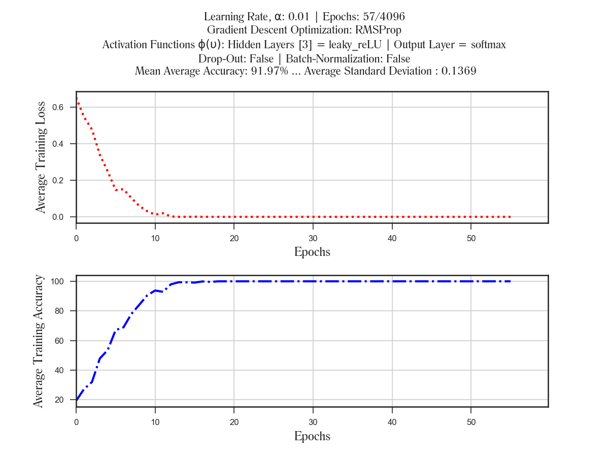
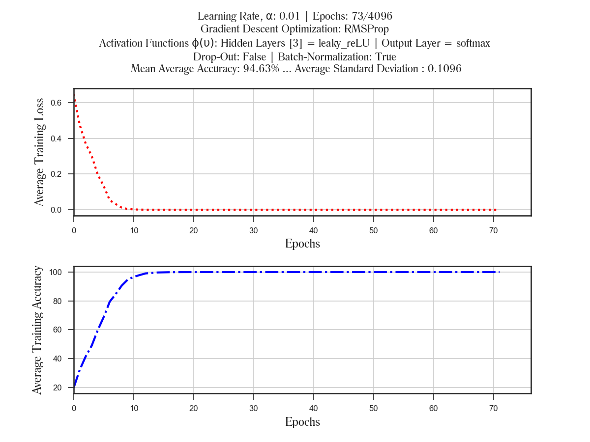
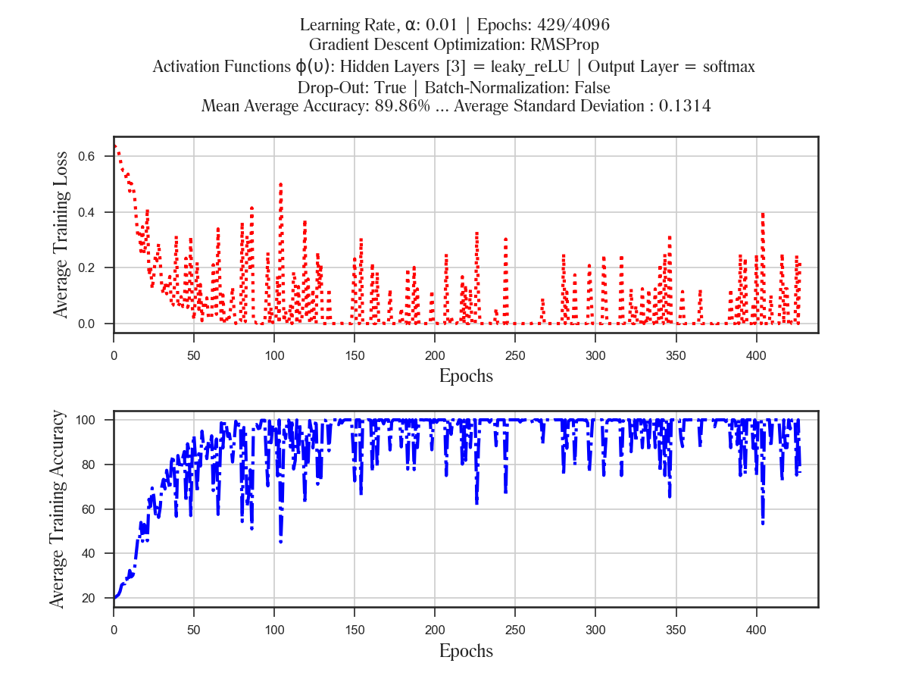
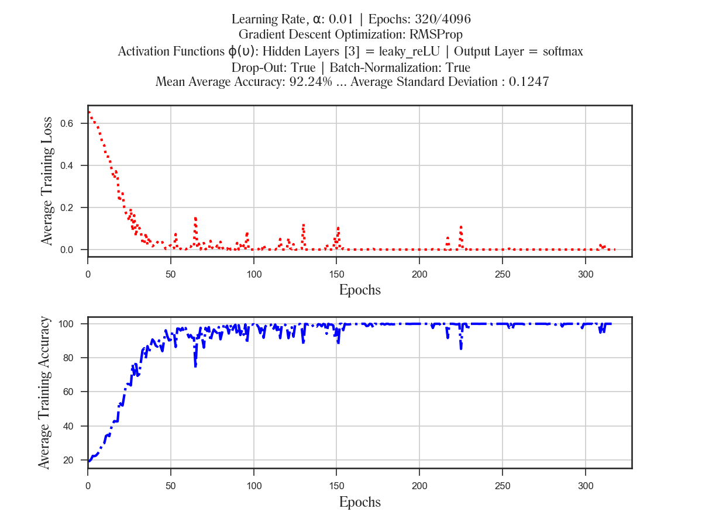

###### Investigating the Behaviour of Deep Neural Networks for Classification
#### Phil Kim's 'Deep Learning with Matlab' book in Python

######  A FEED-FORWARD DEEP NEURAL NETWORK with:
- [x] Batch Normalization
- [x] Activation Functions
- [x] Delta Error Rule
- [x] Backward Error Propagation
- [x] Weight Update Optimization Techniques
- [x] Drop-Outs

##### Some Results:
###### Experiment 1:

###### Experiment 2:

###### Experiment 3:

###### Experiment 4:

> [Project Hypothesis](https://www.researchgate.net/project/Investigating-the-Behaviour-of-Deep-Neural-Networks)

(c) 2017
###### Email: oasomefun@ieee.org
###### Somefun, O.A.
